# Sourdough Barbari Bread

## Yield
This recipe will produce 6 loaves each with an average weight of 350g.

## Levain mix
Time: 20:00-20:15

### Ingredients
- 103g flour (equal parts whole wheat and all-purpose flour)
- 103g water
- 52g starter (24hr fed)

### Yields
258g of 20% seeded, 100% hydrated levain

### Comments
This step is essentially the same as feeding the starter - except here we feed the starter to get a larger amount of it than our initial batch. So if I usually keep a 170g starter batch and I need 88g of levain in the final dough mix, here I will feed such that I get, say, 258g of levain so that I could use the 88g for the dough and keep the rest as the starter for future bakes. When the starter/levain is at its highest rise, a portion of it will be used in the dough mix and the rest will be kept as the future starter.

Before making the levain (or feeding the starter), if the starter has liquid on top of it (hooch), mix it well before using it. Then, in a mixing bowl, pour the water and add the appropriate amount of the starter and mix well. Then add the flour and mix well. 

There is the option to use a 20% seeded levain which rises to full bloom at about 3:30 hr after the mix. 10% seeded levain takes about 4-4:15 hour to rise to full bloom. This can be useful for adjusting the schedule. These times could vary depending on the environment temperature. Usually, after mixing the levain, I place the jar in the oven and heat the oven only a little bit to raise the temperature to about 40-50. Take the temperature into account when adjusting your schedule. To know when the levain is at its highest, pour the levain into a tall glass jar with at least twice space to hold the initial levain mix (it won't rise to more than twice its initial volume). Throughout the next few hours, the levain will keep rising up to a maximum. At that point it will start falling and leaving a residue mark on the jar that is visible from the outside. Keep watching the levain throughout this time. The levain is ready as soon as the tide mark appears on the jar meaning that it has risen to its highest and is beginning to subside. To make sure that the levain is ready, drop a spoonful of it into a glass of water. If it floats on top of the water, it's good enough for mixing into the dough.

_24 hour fed starter after mixing back its liquid - top view_
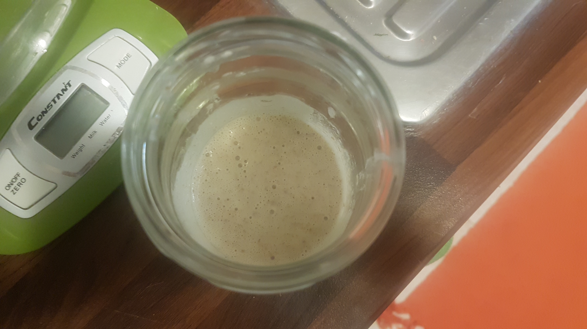

_24 hour fed starter after mixing back its liquid - side view_
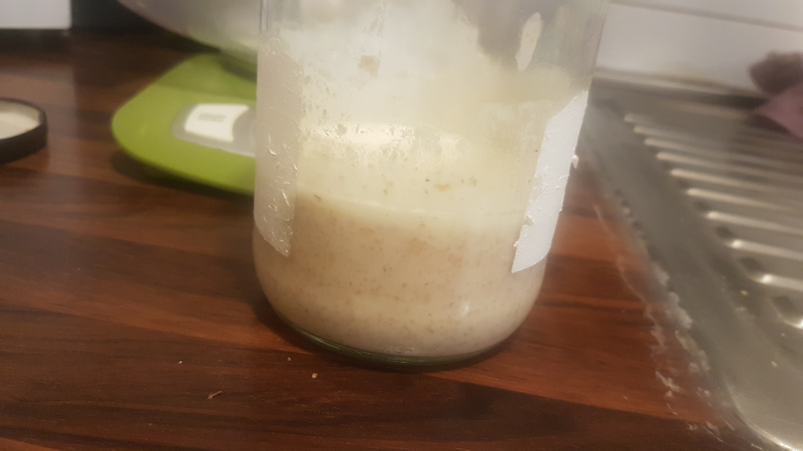

_Levain immediately after the mix - notice that I've marked the level of the mixture on the mason jar with a line made of dough._
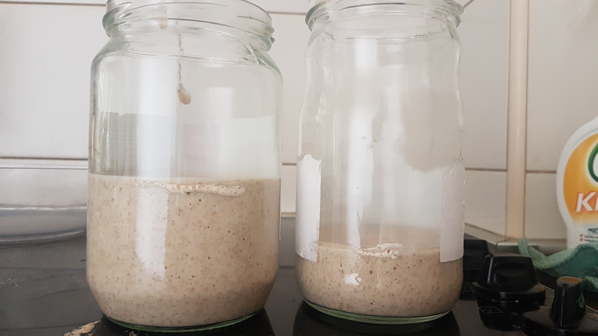

_Levain immediately after the mix - top view_
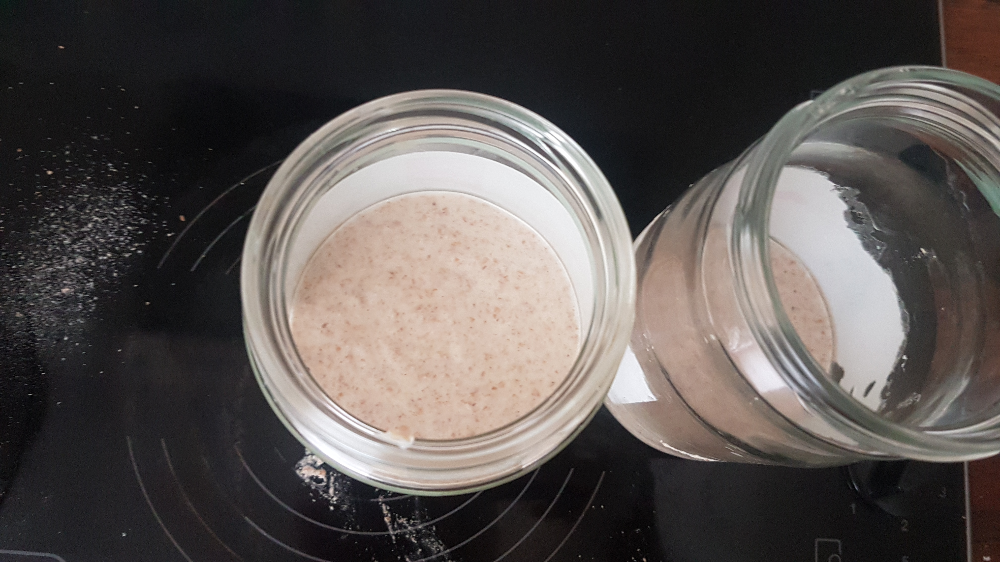

## Levain rise
Time: 20:15-23:45

### Comments
Basically how long it takes for the levain to rise to its highest depends on the temperature and its strength. If you find out that, in the same temperature, your levain takes ever longer to rise, chance is it's losing its strengths. This could happen when you neglect to feed the starter once or twice a week. Probably a full week of feeding the starter every 24 hours, with no fridge storage in between feedings, could restore its vitality. From then on, feed it 3 times a week: once 48h before the levain mix, 24h before, and once the levain mix itself. After mixing the levain into the dough, store it in the fridge for slow fermentation. If not baking for one week, feed the starter twice 24h apart and store it in the fridge after the second feeding. 

_Levain at its highest rise. Compare the current level with the dough line marking. Also notice the faded tide mark above the surface._
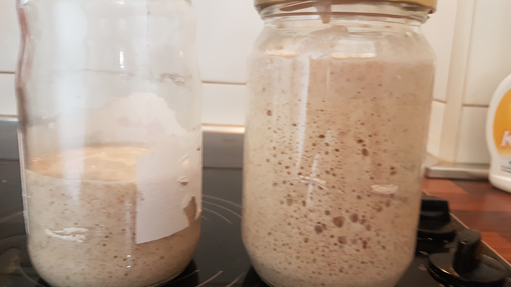

_Levain at its highest rise. Notice the bubbles on top._
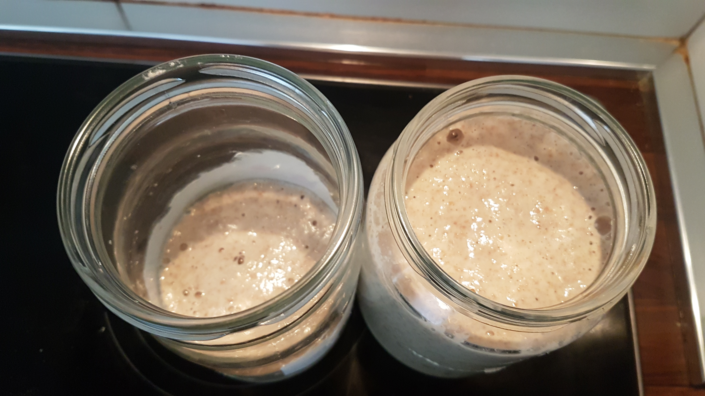

## Initial dough mix
Time: 22:15-22:35

### Ingredients
- 1105g water
- 1430g all-purpose flour

### Comments
Pour all the water in the bowl and then add about three quarters of the flour and start mixing with hand until you get an almost smooth batter. Continue adding the flour little by little while mixing. Add a small amount of the flour, mix well, then add more flour and so on. Continue until all the flour is gone. Mix ingredients until all the flour is incorporated into the bulk of dough, then perform a series of stretching exercises on the dough for ~5 min. 

After you're finished mixing and working the dough, scrape the dough sticking to the walls of the container back into the dough. Dough sticking to the walls dries up fast and, if incorporated later into the dough, could reduce dough hydration more than expected. It could also introduce hard lumps into the dough and the final bread if it dries up too much.

### Stronger dough
To get a stronger dough before the bulk fermentation begins, you could start the initial dough mix 1:50 before you expect to have the final dough mix and schedule a series of stretches and folds 30 min before the final dough mix. This way, as the fermentation has not yet begun, we're not afraid of losing the fermentation gas inside the dough and could perform stretches and folds more vigorously, more abundantly, and perhaps more effectively. We might kick-start the bulk fermentation with a stronger dough with less need for stretches and folds during the bulk fermentation, trap more gas during the initial stages of the fermentation and avoid losing it while exercising the dough. Perhaps one or two sets - one immediately after the initial dough mix and another 30 min later - could give us enough strength. If the strength is still not enough 30 min after the final dough mix, schedule more sets of stretch and fold 20 min apart. This has however the drawback that you will have to mix the levain into a very strong dough when it comes to final dough mix. This is more difficult as the dough tends to hold itself tighter and might need extra labour. Alternatively, you can start mixing the dough one or two hours before the final dough mix and, immediately after the final dough mix, perform a series of stretches and folds for ~5 minutes.

### Stretch and fold method
Place a small bowl of water at hand to wet the hands as needed so the dough doesn't stick to them. Using one hand, detach the top portion of the dough from the container, then, while holding the container with one hand and using the other hand, quickly lift the top portion, so the dough is stretched, and fold it over the bottom portion. Turn the bowl 90 degrees and repeat. Proceed with two more turns so the container comes back after a whole 360 degrees. Later stretch and folds (during the bulk fermentation) must be ever gentler not to disturb the gas that is already built up inside the dough too much.

### Alternative method of stretch and fold
From the right and left of the container, shove the wet hands underneath the dough and gently lift the middle part so that the top and bottom sides hang. Lift further so the hanging sides stretch enough. Then place the dough back so that one of the hanging sides now lies on the other and the dough is folded. Turn the container so that what was the left and right sides of the dough will now be the top and bottom sides (the dough will turn 90 degrees). Repeat the lift, stretch, fold, turn procedure (another 90 degree). Lift, stretch, fold, and turn two more times so that the whole 360 degree is covered. This method might work better when the dough contains oil because otherwise the dough keeps sticking to the container and, when you try to lift the middle portion, tends to lift the container with it since it can't be held down with one hand.

### Container with volume measurement marking
Use a transparent (glass or plastic, preferrably with volume marking) container for mixing so that the rising progress of the bulk could be tracked after the final dough mix. If you don't have a large enough mixing container with fine enough measurement markings, you can easily make one! A transparent plastic container will be easier for this purpose as you'll be able to engrave permanent markings on the wall using a sharp object. Put your container on the kitchen scale, pour enough water in it so the water rises about 5mm. For my container, 200g of water rises to about 5mm. When the water stands still, mark the water level on the container wall. For me, the first mark stands for 200ml. You can assume the density of water to be 1kg/lit so 200g of water will occupy 200ml. Pour another equal amount of water (according to the scale), wait for it stand still, then put the second marking. Continue all the way to the top of the container. I have placed 200ml markers on my container wall and enlarged marker for multiples of 1 liter.

_Container with volumetric markings made using a sharp kitchen knife_
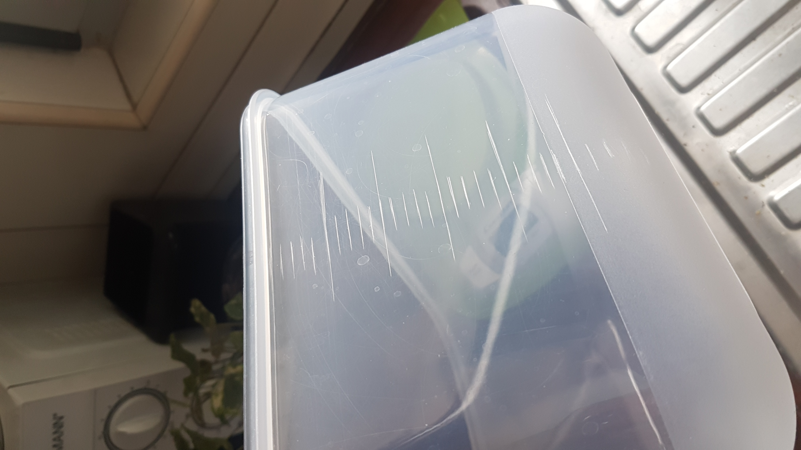

_Initial dough mix_
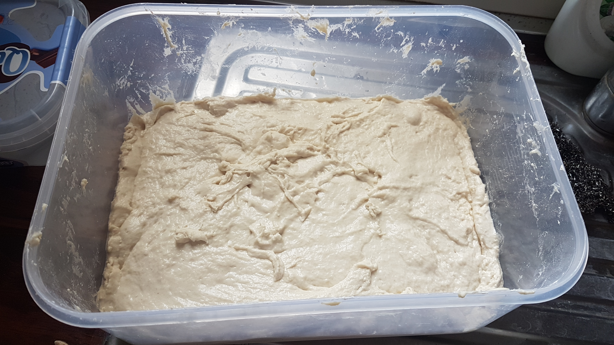

## Autolyse
Time: 22:35-23:45

### Comments
Cover the dough container with a damp towel and let it rest for an hour so the water is fully absorbed into flour particles and the right chemical reactions take place to turn flour proteins (gliadin, glutenin...) into gluten. Glutens are very long strands of molecules that attach to one another to form a great network across the bulk of dough. This is essentially what we recognize as dough strength. It is responsible for the dough holding to itself without breaking when stretched. The tiny compartments within the gluten network help trap and keep the fermentation gas inside the dough. These compartments will turn to the differently sized wholes within the crumb of the finished bread. The gluten is also responsible for the chewy texture of the final bread.

## Final dough mix
Time: 23:45-00:15

### Ingredients
- 2535g autolysed dough
- 27g salt
- 88g levain

### Yield
2650g of 78% hydrated, 3% seeded dough

### Comments
Measure and pour the levain into a bowl, then add the salt to it. Mix well to dissolve the salt in the levain water. Then pour the levain mixture into the autolysed dough. Mix the levain into the dough by consecutive stretch and dough exercises. Continue stretching and folding for about 10 min to make sure that the levain and salt are evenly mixed in. This has the added benefit of building up further dough strength so that fewer stretching and folding sets will be needed during the fermentation. Mixing the levain and salt into the dough through random pinching and squeezing motions tends to weaken the strength that has already been built into the dough during autolyse requiring more stretches and folds during fermentation.

For 6 x 417g dough rounds, we prepare 150g of extra dough to compensate for the dough measurement errors and the leftover dough sticking to the bowl, spillage, etc. Generally, consider an extra 25g of dough per loaf.

_The salt is dissolved in the levain and the levain will be added to the dough_
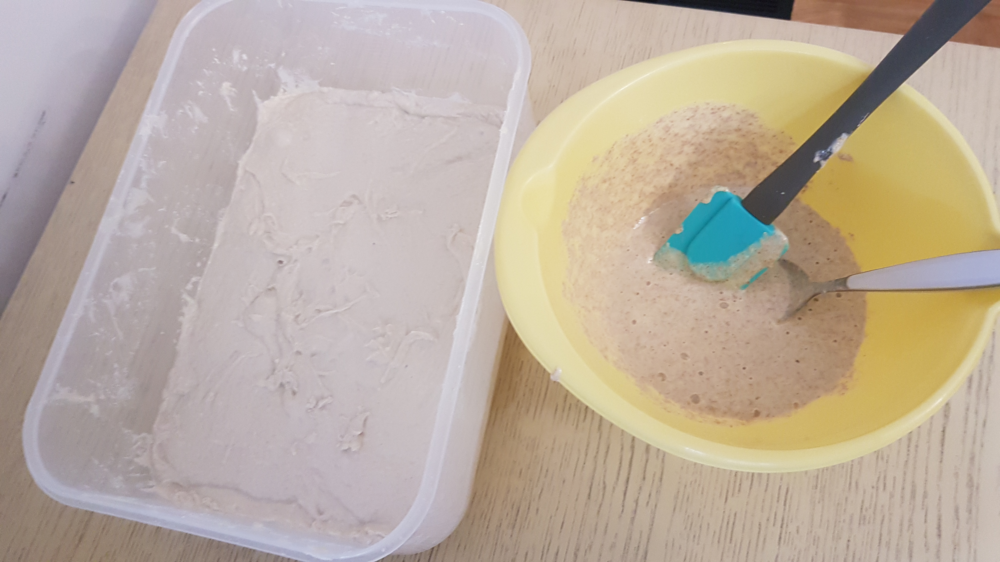

_After the final mix_
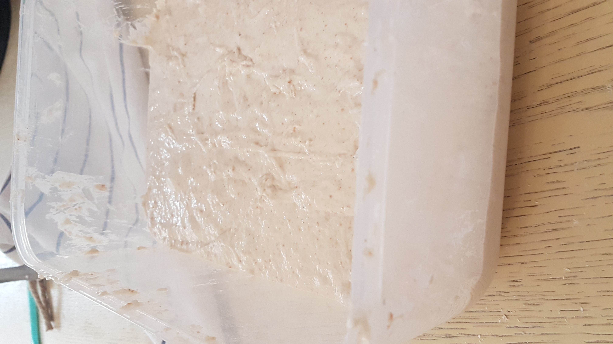
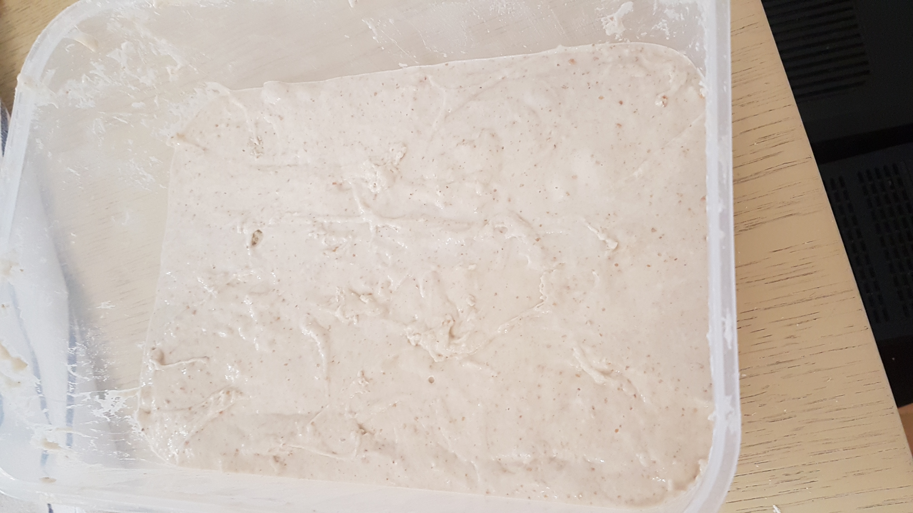

_Final dough mix volume_
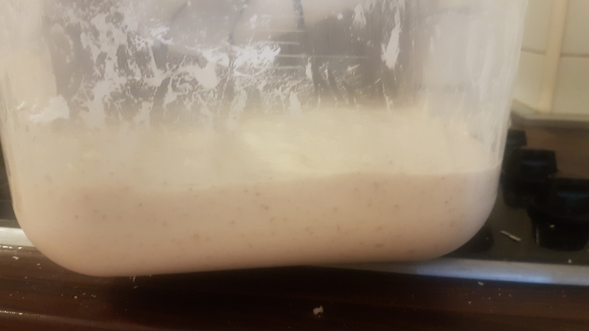

## Bulk fermentation
Time: 00:15-14:45

## Comments
Cover the bowl with a damp towel in the room temperature (25~30 deg C)
- 01:00 one set of stretch and fold
- 01:45 one set of stretch and fold (if needed)
- 02:30 one set of stretch and fold (if needed)

Before performing the first set of stretches and folds, just as the dough surface is flat, mark the level of the dough on the exterior of the container (by sticking a thin, line-like piece of dough on one of the measurement marks) so you can see, at any time during the bulk rise, how much the dough has risen. If you have a container with measurement marks, just note down the starting volume of the dough.

Before every scheduled set of stretch and fold, perform the window pane test to see if the dough has achieved enough strength already or it needs more stretching and folding. 

### Window pane test
Pinch two points of the dough almost 5cm apart and stretch between the fingers. The dough should be stretched like cling wrap around the fingers to make a very thin, almost transparent window pane. If the dough is not yet strong enough, it will tear before the window pane is formed.

### Timing
How long the bulk rise takes depends on the strength of the levain and the ambient temperature (which could vary over time). These two factors are not easily measurable or controllable. The bulk rise is done when the volume of the dough increases to about 125% of its starting volume (which you should have noted before the first set of stretch and fold). A rise that's too much less than this could result in a tighter crumb unless the loaves are given a longer final rise (after shaping). A rise that's considerably higher than this could consume all the dough strength and without enough strength the dough will lose much of its gas during the preshape and shape steps. Trust the volume measurements more than the time measurements. Besides when the dough is over-fermented, it becomes extremely difficult to work with due to its loss of strength. It becomes sticky and won't hold to itself as a stronger dough would.

In my experience (see previous bake entries), for type 500 (all-purpose) flour, a 150% rise leads to a slightly tighter crumb than a 110% rise with equal final rise times. This is because the longer the bulk rise, the more the dough strength is depleted and the capacity to hold fermentation gas. Somewhere in between should be the ideal limit which is different for different types of flour - again different flour types have different capacity for keeping dough strength. For type 500 flour, go for a 125% bulk rise and for type 850 flour you could go up to 160%. For anything in between, make linear adjustments. Although I haven't experimented with intermediate flour types yet, I assume this calculation to be safe. For instance, for type 650, you could go for a 140% bulk rise because:
(650 - 500) / 10 + 125 = 140

_The window pane test before the first set of stretch and fold_
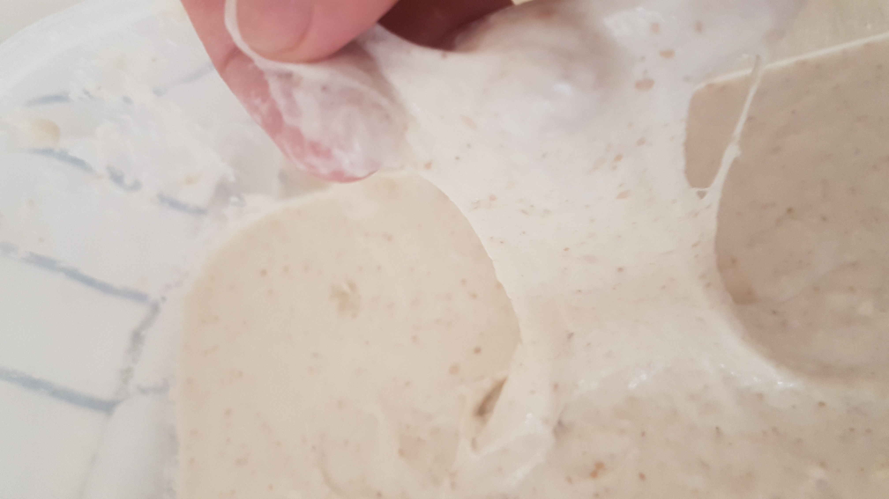
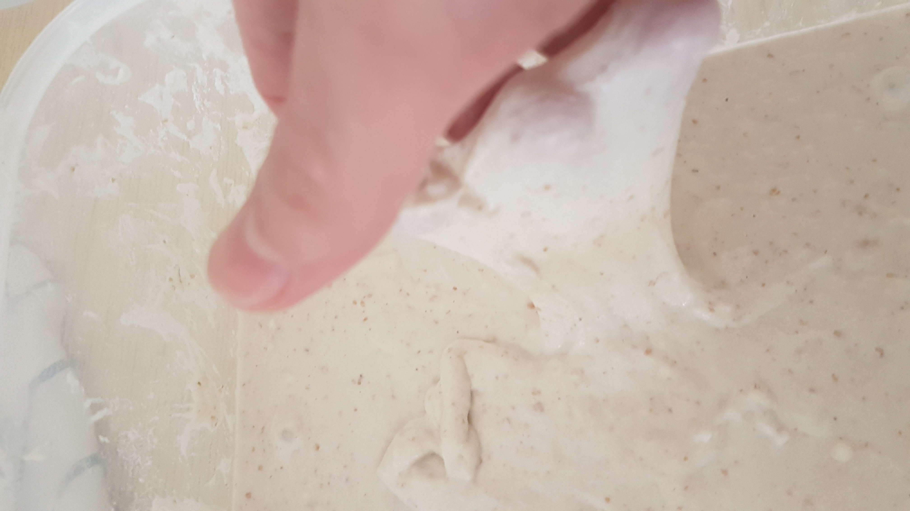

_After the bulk fermentation: note the change in volume and the bubbles that are visible inside the dough_
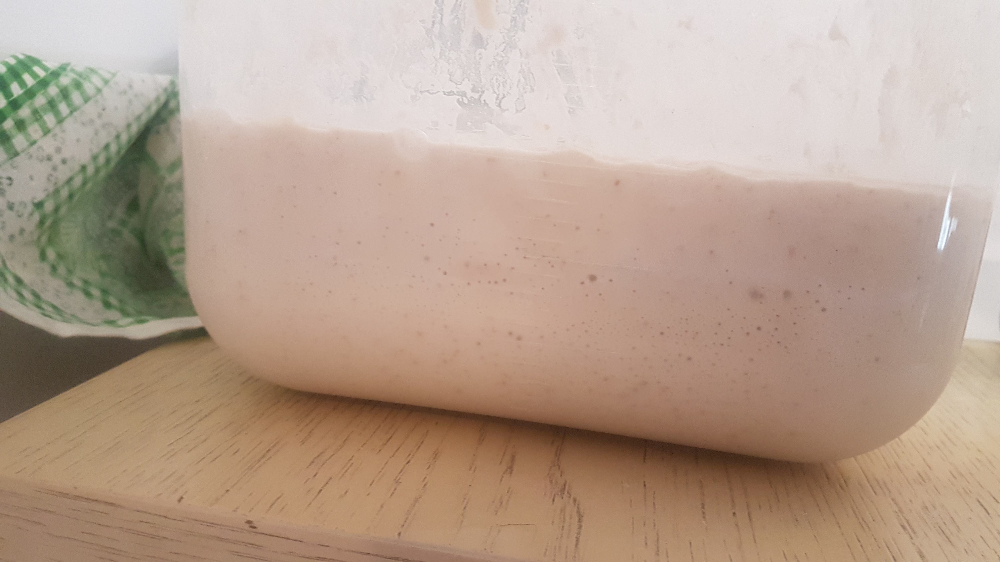

_After the bulk fermentation: note the bubbles on top_
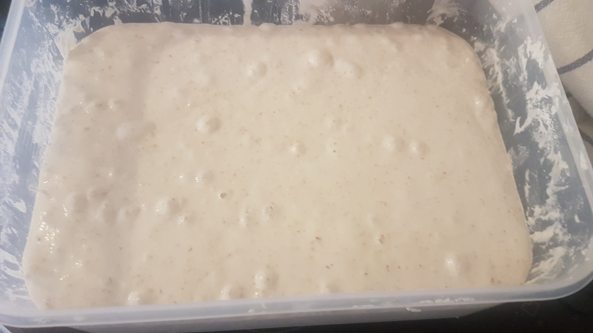

## Barbari glaze (ferni)
Time: 14:15-14:45

### Ingredients
- 26g whole wheat
- 210g water

### Yield
228g ferni

### Comment
Pour the water in a small pan, then add the flour little by little while stirring the mixture to prevent formation of clots. When all the flour is added, place the pan on the stove (medium heat) and continue stirring until enough water is evaporated and enough flour starch is dissolved and the desired thickness is achieved. The starchier the ferni, the deeper the colour that it will impart to the loaf crust after baking.

Optimal starting rate for ferni seems to be 810% hydrated mixture prepared according to the instructions. Amount of ferni to prepare is about 38g for a 417g loaf of barbari.

_Prepared ferni_
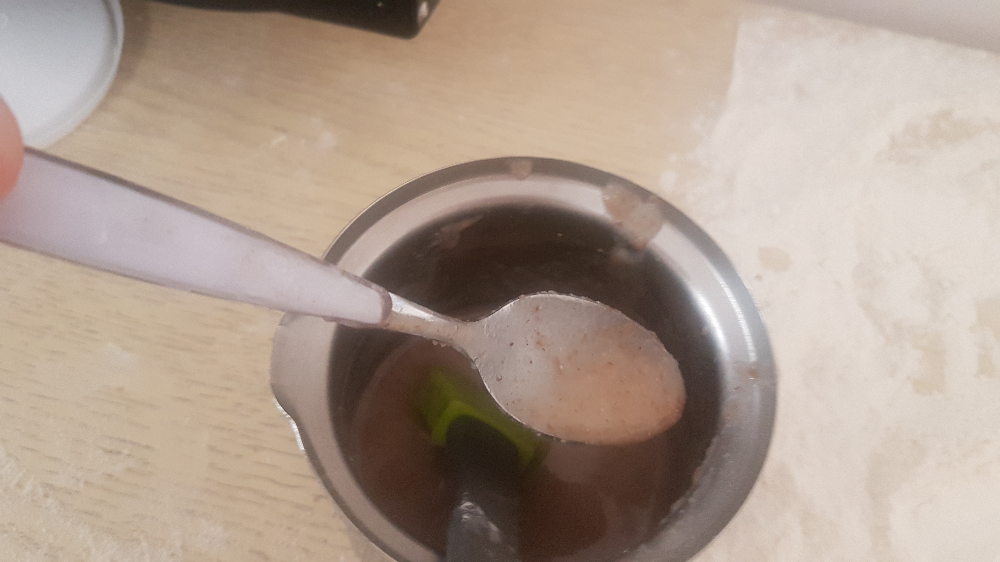

## Preshape
Time: 14:45-15:15

### Comments
Prepare the work surface, divide and preshape the rounds, bench rest.

### Work surface
Probably a table top horizontally divided into three sections. The leftmost section is where the bulk is placed (top) along with the scale (bottom left) and a bowl of water (bottom right, for wetting the bench knife and the hand as needed). Also, do not dump the whole bulk on the table (as some recipes indicate) so it doesn't spread (as it is quite wet) to occupy so much space. Just grab a piece from inside the mixing container using a wet hand and cut it off using the bench knife. Place the piece on the floured scale tray and adjust the weight by cutting small pieces off it using the bench knife or adding to it. Then place the dough in the middle section of the table. At this stage, each dough round should be around 417g.

The middle section is the shaping area where the shaping techniques are performed (folding sides, rotating, skin building, etc). While performing the techniques, slightly wet the hand and the bench knife if the dough starts sticking to them. The middle section must NOT be floured previously - the wetness from the hand and the bench knife will keep the skin of the dough wet and prevent it from sticking to the surface too much (unless it's overfermented in which case you're about screwed anyway!). After shaping the dough, lift it using the wet bench knife and place it in the rightmost section of the table.

The right section is floured beforehand and is where the preshaped dough rounds are placed. Allow enough space between them because they might spread (as they are highly hydrated).

If the right section of the table (bench) doesn't have enough room to hold all the rounds, (as they are sparsely placed), preshape, shape, and bake as many of the loaves as you have room for rounds on the bench. As soon as the first loaf goes into the oven and a spot on the bench becomes available, divide and preshape another round. Remember to shape each round about 30 min after its preshape.

_Work surface_
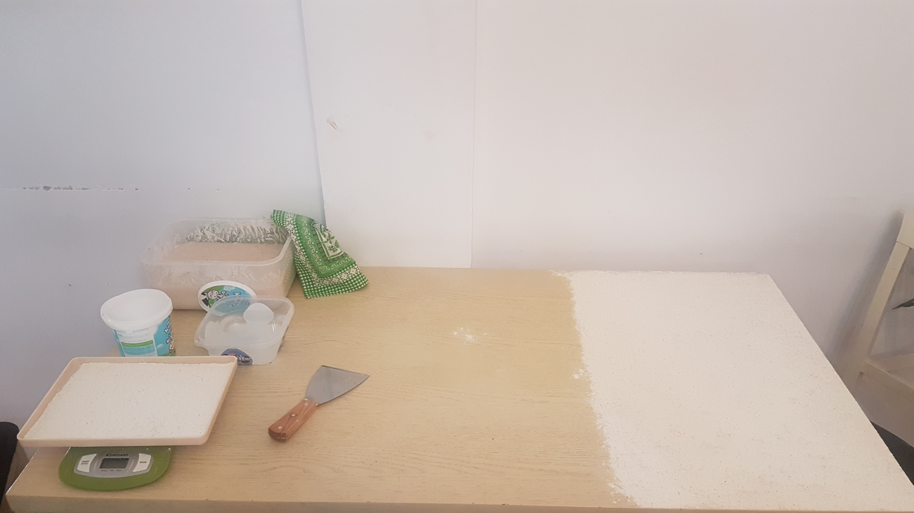

### Preshaping method
After placing each round on the middle section, grab the bottom side, fold 2/3 way back over the top. With both hands (or with the bench knife in turns), stretch from left and right, fold the left over the centre, fold the right over it. Then stretch and fold the top over it to form an envelope shape with a seam on the top. Pinch the top to seal the seam. Then flip the dough over (with the bench knife) to get the seam side down. Now rotate on the surface and pull toward you to build more tension on the skin.

The shaping trick for the wet dough is to use the bench knife to shovel underneath the dough (south), push it away while rotating it about 180 degrees around the vertical axis, then pull the round using the bench knife towards yourself. Once the dough comes back to its starting point, pull the bench knife off the back. Using two fingers hold the dough right above the bench knife so that pulling the knife out doesn't strech out the dough. With this technique the bench knife keeps the contact point of the dough with the surface from rising up. With the back side held down and the front side rolling in, the dough skin on the top has to stretch and tension is built up.

When enough tension is built on the surface, lift the dough off with the wet bench knife and place it on a floured surface on the right side with the seam side still down.
Don't flour round tops.

_Rest after the preshape_
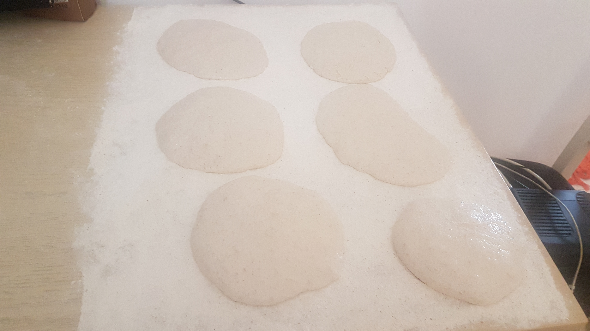

## Shape
Time: 15:15-15:45

### Comments
Preshaping of multiple dough rounds and preparing the ferni takes some time and, by the time that the last dough has been preshaped, the first preshaped dough has already rested on the bench for about 30 minutes and is ready to be shaped. Therefore, start shaping the first dough 20-30 min after its preshape has been done.

For each dough round, without lifting it off the bench, perform the folds to make the envelope package (as in preshaping), then lift the package off the bench and place it in the shaping area seam side down. When folding the package, take care to introduce as little flour inside it as possible. To fold the sides, shove the bench knife under each side, then grab it using one hand and the knife, strech and fold it over. You can shake the excess flour before moving on to fold the other side. After the package lands in the shaping area, rotate using the bench knife and the hand just as in the preshape stage. Then generously flour its spot on the bench and lift it off the shaping area and place it back on the bench seam side down. Using wet hands, flatten it there to make a rounded square that can be held by the palms of both hands held together (almost 10cm x 10cm).

_Shaped rounds_
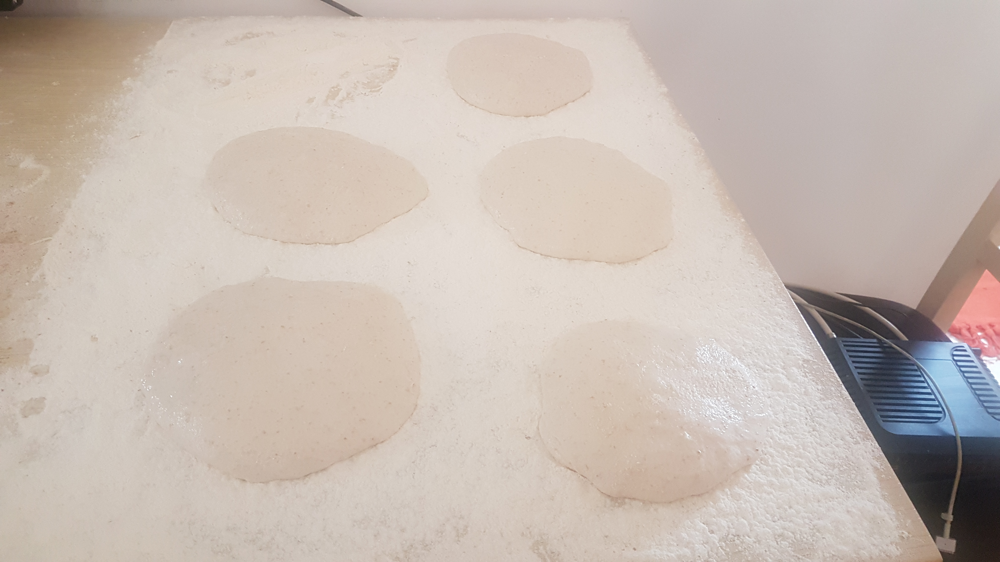

Hours of bench rise will turn the skin of the dough rounds dry. To remedy this, glaze the rounds right after shaping so the final rise won't dry their skin. Glaze the rounds more abundantly and with a rather wet ferni so that the long rise will not completely dry it up and enough wetness remains on the crust to delay its hardening in the oven and there will be enough time for oven spring too. Leave the patterning to be done right before baking.

_Shaped rounds after glazing_


## Final rise
Time: 15:45-23:25

### Comments
In this step, the dough rounds should rise up to a critical point where more gas is built up inside but the round doesn't lose too much strength. We aim for about 112% a rise in this step. We can't exactly measure the volumetric rise of each round but, ignoring temperature variance, we could assume that the final rise has an almost equal rate to the bulk rise and therefore the time needed for a 112% rise will be proportionate to that needed for the bulk rise (125%) by a factor that can be calculated as below. Generally speaking, given the temperature remains steady during the bulk and the final rise, we could estimate the time for the final rise as:
```
t2 = t1 * ln(r2) / ln(r1) 
```
where:
- `t2`: time required for the final rise
- `t1`: time required for the bulk rise
- `r2`: volume increase rate during the final rise
- `r1`: volume increase rate during the bulk rise

*Note*: For type 500 flour, we go for around 115% rise and for type 850 flour 120%-125%. If the bulk has been over-fermented, you should have a shorter bench rise.

_Shaped rounds after the final rise_


## Bake
Preheat time: 22:25
Time: 23:25-01:25

### Comments
Start preheating the oven 01:00 hour before putting in the first loaf to 250 deg C.

The first round to have been shaped should be baked first. If the glaze is too much dried, apply a little more of it on top of the round. Grooving should be done right before baking (not right after shaping) because the pattern begins to dissappear during the bench rise. Punch the pattern by putting the 6 fingers on your both hands (3 middle fingers on each hand) together in a row to form the likeness of a comb, then punch the comb deep into the flattened dough to create about 5-6 rows of finger-holes that go from the left end of the round to the right end of it. The rows should be about 2cm apart. Leave unpunched margins of about 2cm at the top and bottom and 1cm at the sides.

_Barbari pattern on the dough_
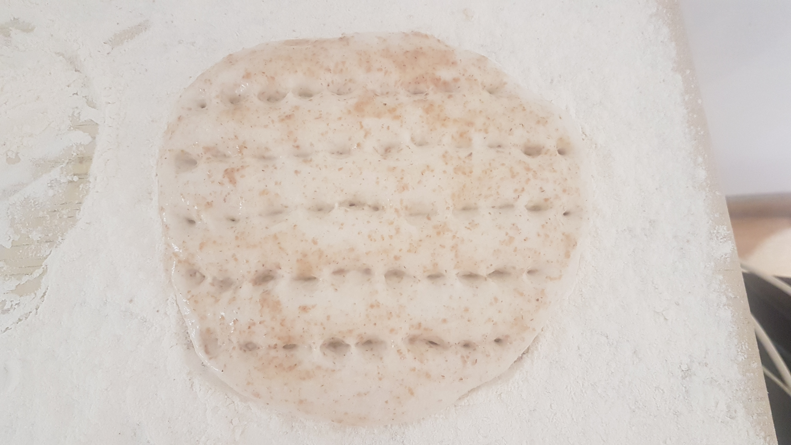

Place the peel near the bench and flour generously with whole wheat flour or milled bran. Then lift the flattened dough off with both hands and extend it longitudinally to the full size of the loaf (30 cm) while maintaining its width and place it on the peel floured side down. Take care not to disturb the shape too much (except for extending the length) when lifting with the hands. Put your hands together with the back of the hands down right in front of the round. Then shovel both your hands underneath the round. After spreading the dough on the peel you can sprinkle the top with sesame, poppy, other seeds or nuts, etc. Bring the peel near the oven and pull the oven tray out. Then place the loaf in the oven by sliding it on the tray and putting the tray back in the oven. No need to flour or grease the oven tray beforehand. Immediately turn the oven temperature to 225 deg C.

_Dough rolled out on the peel and topped with sesame_
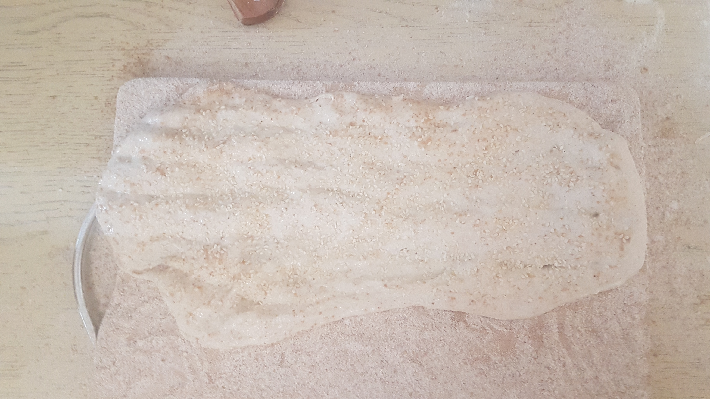

_Dough finally placed in the oven_
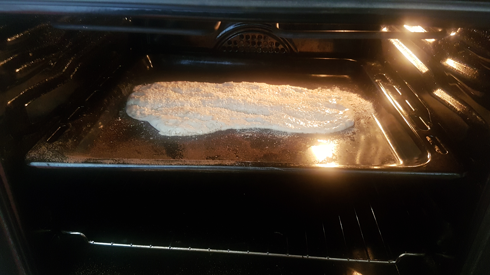

At this point also start shaping the next barbari dough that has rested on the bench for more than 20 min and, if there is more dough in the bulk that is not preshaped, preshape another dough round. Remember to remove the flour off the bottom middle section using the bench knife before that.

As soon as, or if you see one side of the crust taking a golden colour while the other side is still pale, turn the half-baked bread 180 degrees around the vertical axis to make up for the uneven heat distibution inside the oven. 3-4 min before you expect to bring the loaf out, turn the oven temperature to 250 deg C to form the crust.

The loaf should be ready in 00:20 after being put into the oven. Take the bread out and place it on a rack vertically so that air could flow on both surfaces of the loaf. Give each loaf about one hour to cool down before cutting it. You can store the cut loaves in the freezer (in freezer bags) for up to 3 months. When you need a piece, just take it out of the freezer and heat it in a microwave oven or on the stove.

3-4 min before you expect to take the loaf out of the oven, proceed with galzing, patterning, and topping of the next dough round that is shaped already and rested on the bench.

The glaze serves the purpose of keeping the crust from hardening before the bread goes through oven spring during the first minutes of the bake. Placing a water dish inside the oven is useless and an inconvenience too.

_Finished loaves cooling down_
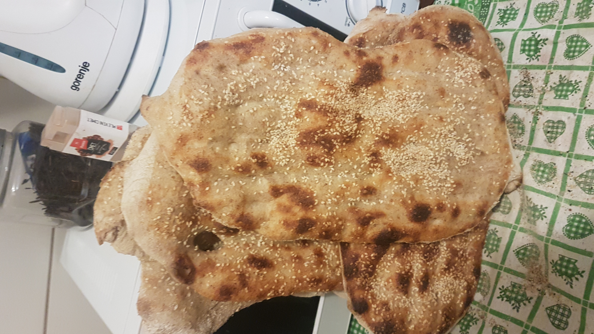

_Finished loaf of barbari_
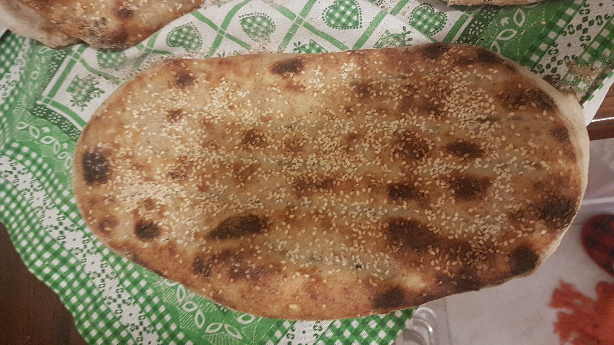

### Excess flour
After sliding the last round into the oven, you could start cleaning your workspace. If you bake every week or more frequently, you'll find that, every time, you're using quite a lot of flour for covering the bench area and the scale tray - not to mention the whole-wheat flour used for the baking peel. I find throwing away all that flour at the end of every bake quite wasteful. So, after all the rounds are gone, I clean all the surface of the working table with the bench knife and pour all the flour, dough residue, etc into a container. I then sift all the contents once or twice to remove large lumps of dough residue and bran. The remaining is some sort of flour which I store and use it for covering the bench area and the scale tray. Remember not to use this flour for mixing the dough as it is of an unpredictable quality.