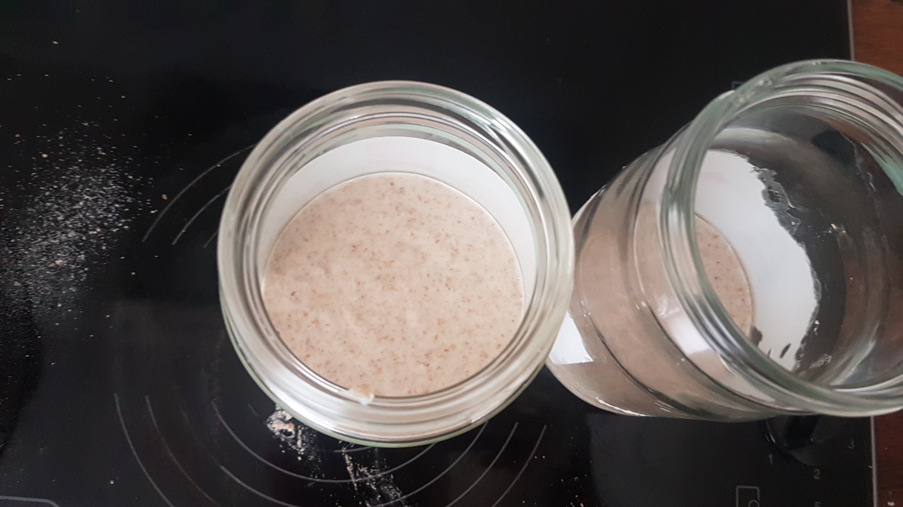
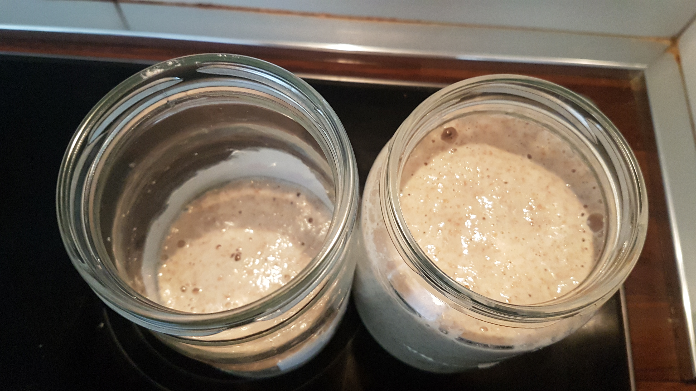
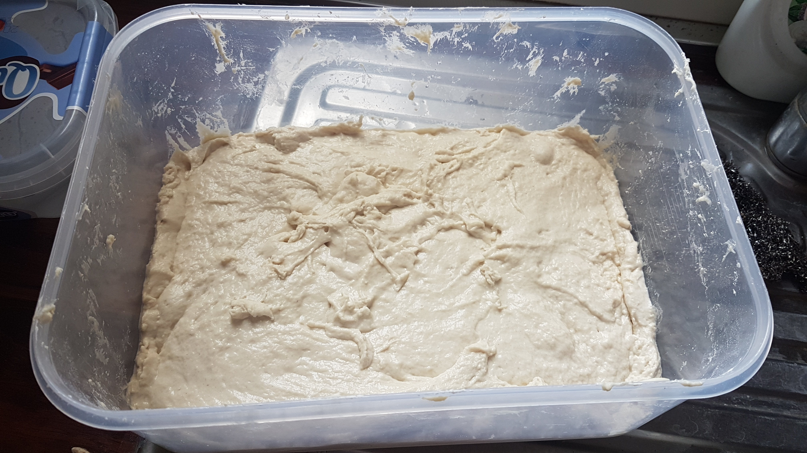
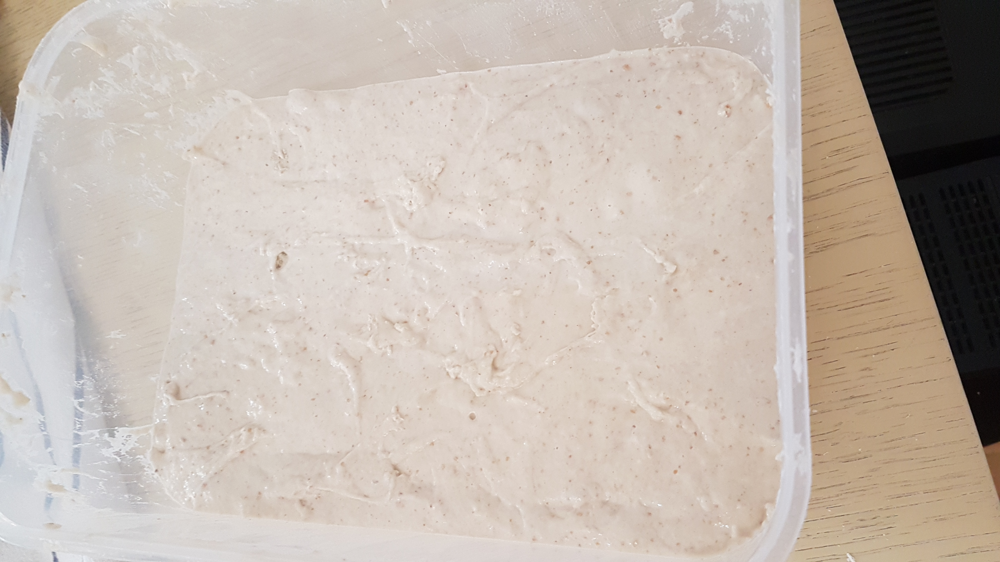
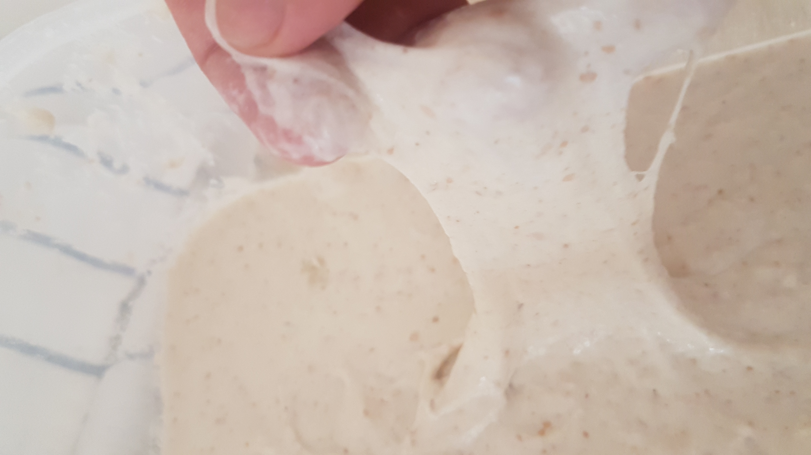
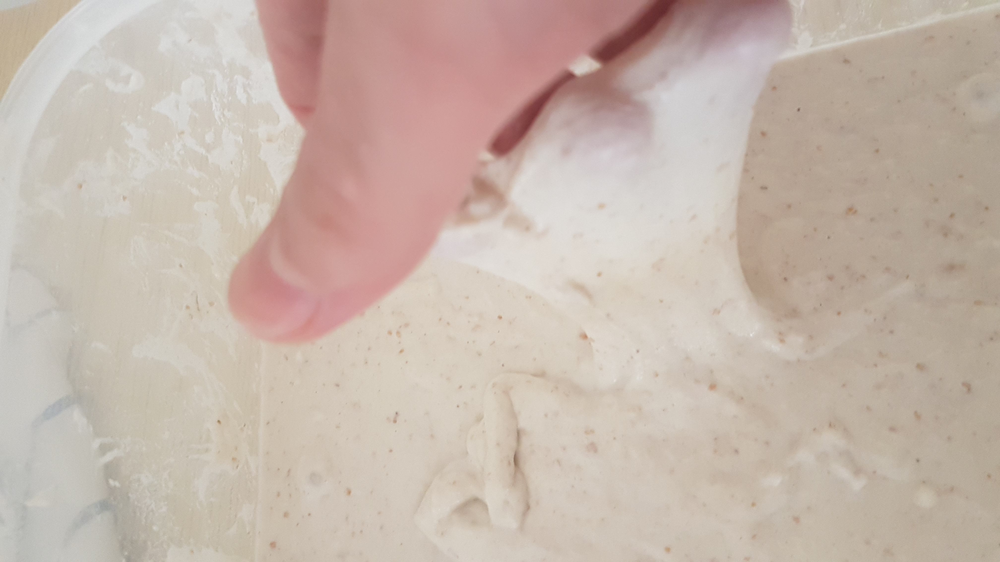
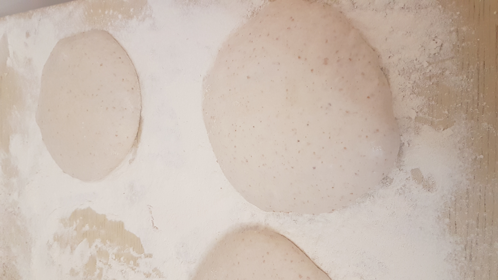
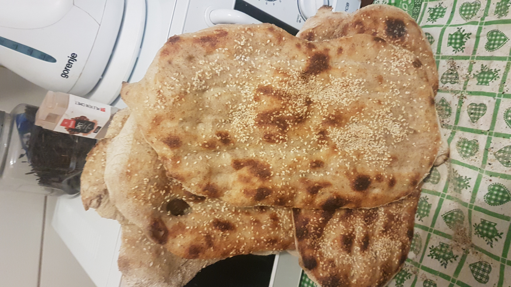
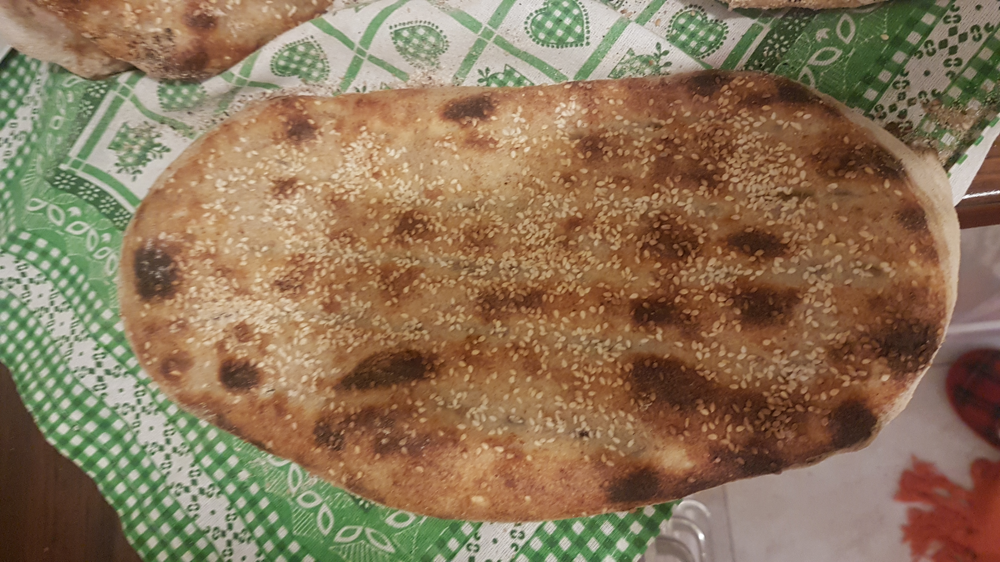

# Sourdough Barbari Bread 8
Date: Sun 2020-07-19

## Levain mix
Time: 12:30-13:00

### Ingredients
- 200g flour (equal parts whole wheat and all-purpose flour)
- 200g water
- 100g starter (24hr fed)

### Comments
This step is essentially the same as feeding the starter - except here we feed the starter to get a larger amount of it than our initial batch. So if I usually keep a 150g starter batch, here I will feed such that I get, say, 500g of so that I could keep 323g of it for the dough and keep the rest (177g) as the starter for future bakes. When the starter/levain is at its highest rise, a portion of it will be used in the dough mix and the rest will be kept as the future starter.

As we use a mixture of different flours for feeding the starter/levain and we use the same mixture every time, you can keep a store of premixed flour (calling it the starter feed), and use it when feeding the starter (mixing the levain).

These ingredients will produce 500g of 20% seeded, 100% hydrated levain. Only 323g of it is needed for the dough. The remaining 177g will serve as our starter for future.

Before making the levain (or feeding the starter), if the starter has liquid on top of it (hooch/vinegar), mix it well before using it. Then, in a mixing bowl, pour the water and add the appropriate amount of the starter and mix well. Then add the flour and mix well. 

There is the option to use a 20% seeded levain which rises to full bloom at about 3:30 hr after the mix. 10% seeded levain takes about 4-4:15 hour to rise to full bloom. This can be useful for adjusting the schedule. To know when the levain is at its highest, pour the levain into a tall glass jar with at least twice space to hold the initial levain mix (it won't rise to more than twice its initial volume). Throughout the next few hours, the levain will keep rising up to a maximum. At that point it will start falling and leaving a residue mark on the jar that is visible from the outside. Keep watching the levain throughout this time. The levain is ready as soon as the tide mark appears on the jar meaning that it has risen to its highest and is beginning to subside. To make sure that the levain is ready, drop a spoonful of it into a glass of water. If it floats on top of the water, it's good enough for mixing into the dough.

### Observations

## Levain rise
Time: 13:00-16:30

### Observations
4 hours after the levain mix, the levain hasn't still risen to its highest. This also happened last time. This might be because I've been feeding the starter no more than twice a week (once 24h before mixing the levain and once the levain mix itself). Sometimes I haven't baked for a week and the starter hasn't been fed for two weeks. Between bakes, I keep the starter in the fridge so the fermentation slows down and the yeast don't consume too much of the food too fast. This has been going on for almost 10 weeks and starter isn't probably as strong as it was when it was younger. Probably a full week of feeding every 24 hours, with no fridge storage in between feedings, could restore its vitality. From then on, feed it 3 times a week: once 48h before the levain mix, 24h before, and once the levain mix itself. After mixing the levain into the dough, store it in the fridge for slow fermentation. If not baking for one week, feed the starter twice 24h apart and store it in the fridge after the second feeding.

## Initial dough mix
Time: 15:10-15:40

### Ingredients
- 945g water
- 1251g all-purpose flour

### Comments
Mix ingredients until all the flour is incorporated into the bulk of dough, then perform a series of stretching exercises on the dough for 2-3 min. Pour all the water in the bowl and then add about three quarters of the flour and start mixing with hand until you get an almost smooth batter. Continue adding the flour little by little while mixing. Add a small amount of the flour, mix well, then add more flour and so on. Continue until all the flour is gone.

To get a stronger dough before the bulk fermentation begins, you could start the initial dough mix 1:50 before you expect to have the final dough mix and schedule a series of stretches and folds 30 min before the final dough mix. This way, as the fermentation has not yet begun, we're not afraid of losing the fermentation gas inside the dough and could perform stretches and folds more vigorously, more abundantly, and perhaps more effectively. We might kick-start the bulk fermentation with a stronger dough with less need for stretches and folds during the bulk fermentation, trap more gas during the initial stages of the fermentation and avoid losing it while exercising the dough. Perhaps one or two sets - one immediately after the initial dough mix and another 30 min later - could give us enough strength. If the strength is still not enough 30 min after the final dough mix, schedule more sets of stretch and fold 20 min apart. This has however the drawback that you will have to mix the levain into a very strong dough which is more difficult as the dough tends to hold itself and might need extra labour. Alternatively, start mixing the dough just one hour before the final dough mix and immediately after the final dough mix, perform a series of stretches and folds for 4-5 minutes.

After you're finished mixing and working the dough, scrape the dough sticking to the walls of the container back into the dough. Dough sticking to the walls dries up faster and, if incorporated later into the dough, could reduce dough hydration more than expected. It could also produce bumps inside the dough and the final bread if it dries up too much.

This time we're making 400g more dough than is needed for our bread. We're going to make a huge pizza with it.

### Stretch and fold method
Place a small bowl of water at hand to wet the hands as needed so the dough doesn't stick to them. Using one hand, detach the top portion of the dough from the bowl, then, while holding the bowl with one hand and using the other hand, quickly lift the top portion, so the dough is stretched, and fold it over the bottom portion. Turn the bowl 90 degrees and repeat. Proceed with two more turns so the bowl comes back after a whole 360 degrees. Later stretch and folds (during the bulk fermentation) must be ever gentler not to disturb the gas that is already built up inside the dough too much.

### Alternative method of stretch and fold
From the right and left of the bowl, shove the wet hands underneath the dough and gently lift the middle part so that the top and bottom sides hang. Lift further so the hanging sides stretch enough. Then place the dough back so that one of the hanging sides now lies on the other and the dough is folded. Turn the bowl so that what was the left and right sides of the dough will now be the top and bottom sides (the dough will turn 90 degrees). Repeat the lift, stretch, fold, turn procedure (another 90 degree). Lift, stretch, fold, and turn two more times so that the whole 360 degree is covered.

### Container with volume measurement marking
Use a transparent (glass or plastic, preferrably with volume marking) container for mixing so that the rising progress of the bulk could be tracked after the final dough mix. If you don't have a large enough mixing container with fine enough measurement markings, you can easily make one! A transparent plastic container will be easier for this purpose as you'll be able to engrave permanents markings on the wall using a sharp object. Put your container on the kitchen scale, pour enough water in it so the water rises about 5mm. For my container, 200g of water rises to about 5mm. When the water stands still, mark the water level on the container wall. For me, the first mark stands for 200ml. You can assume the density of water to be 1kg/lit so 200g of water will occupy 200ml. Pour another equal amount of water (according to the scale), wait for it be stand still, then put the second marking. Continue all the way to the top of the container. I have placed 200ml markers on my container wall and enlarged marker for multiples of 1 liter.

### Observations

## Autolyse
Time: 15:30-16:30

### Comments
Cover the dough container with a damp towel and let it rest for an hour so the water is fully absorbed into flour particles and the right chemical reactions take place to turn flour proteins (gliadin, glutenin...) into gluten. Glutens are very long molecules that attach to one another to form a great network across the bulk of dough. This is essentially what we know as dough strength. The tiny compartments within the gluten network help trap and keep the fermentation gas inside the dough. These compartments will turn to the differently sized wholes within the crumb of the finished bread. The gluten is also responsible for the chewy texture of the final bread.

### Observations

## Final dough mix
Time: 16:30-16:50

### Ingredients
- 2191g autolysed dough
- 25g salt
- 278g levain

### Comments
This will produce 2500g of 78% hydrated, 10% seeded dough. 

Measure and pour the levain into a bowl, then add the salt to it. Mix well to dissolve the salt in the levain water. Then pour the levain mixture into the autolysed dough and exercise with hands to mix evenly. Right after mixing, perform the stretching and folding exercises on the dough for 4-5 minutes to build up dough strength so fewer stretching and folding will be needed during the fermentation.

For 6 x 400g dough rounds, we prepare 100g of extra dough to compensate for the dough measurement errors and the leftover dough sticking to the bowl, etc.

### Observations
- 1:10 delay
- The mixed dough amounts to 1.8L.

## Bulk fermentation
Time: 16:50-21:10

## Comments
Cover the bowl with damp towel, 25 deg C (we don't have a thermometer)
- 17:30 one set of stretch and fold
- 18:00 one set of stretch and fold

Before performing the first set of stretches and folds, just as the dough surface is flat, mark the level of the dough on the exterior of the container (by sticking a thin, line-like piece of dough) so you can see, at any time during the bulk rise, how much the dough has risen.

At this point, if the dough hasn't got enough strength, schedule another set of stretch and fold (one or more times as needed) every 30 minutes.

Before every scheduled set of stretch and fold, perform the window pane test to see if the dough has achieved enough strength already or it needs more stretching and folding.

### Window pane test
Pinch two points of the dough almost 10cm apart and stretch between the fingers. The dough should be stretched like cling wrap around the fingers to make a very thin, almost transparent window pane. If the dough is not yet strong enough, it will tear before the window pane is formed.

### Observations
- 1:10 delay
- As the dough has had to autolyse for two hours (due to delay in levain rise), and due to the series of stretch and folds right after the final dough mix, the dough is already very strong. 1:10 after the final dough mix, the dough volume has already risen to 2.1L. This could be due to the levain strength as I let the levain rise to its highest even though it took 4.5 hours. Last time, I mixed the final dough before full rise of the levain because the levain was taking too long and I was too much behind on the schedule. I'd expected full rise at 3:30 after the levain mix. I mixed the final dough after 4 hours. Turns out it needed 5 hours. Next time autolyse the dough for 1.5 hour and perform 5 min of stretch and folds immediately after both the initial and the final dough mix.          

## Preshape
Time: 21:10

### Comments
Prepare the work surface, divide and preshape 6 x 400g rounds, and then prepare the glaze (ferni)

Preheat the oven for the barbari at 250C.

### Work surface
Probably a table top horizontally divided into three sections. The leftmost section is where the bulk is placed (top) along with with the scale (bottom left) and a bowl of water (bottom right, for wetting the bench knife and the hand as needed). Also, perhaps try not dumping the whole bulk on the table so it doesn't spread (as it is quite wet) to occupy so much space. Just grab a piece from inside the mixing container using a wet hand and cut it off using the bench knife. Place the piece on the floured scale and adjust the weight. Then place the dough in the middle section of the table.

The middle section is the shaping area where the shaping techniques are performed (folding sides, rotating, skin building, etc). While performing the techniques, slightly wet the hand and the bench knife if the dough starts sticking to them. The middle section must NOT be floured - the wetness from the hand and the bench knife will keep the skin of the dough wet and prevent it from sticking to the surface too much. After shaping the dough, lift it using the wet bench knife and place it in the rightmost section of the table.

The right section is floured beforehand and is where the preshaped dough rounds are placed. Allow enough space between them because they might spread (as they are highly hydrated).

If the right section of the table (bench) doesn't have enough room to hold all the rounds, (as they are sparsely placed), preshape, shape, and bake 6 rounds first (or as many as you have room for). As soon as the first loaf goes into the oven and a spot on the bench becomes available, divide and preshape another round. Remember to shape each round about at least 30 min after its preshape.

### Preshaping method
After placing each round on the middle section, grab the bottom side, fold 2/3 way back over the top. With both hands (or with the bench knife in turns), stretch from left and right, fold the left over the centre, fold the right over it. Then stretch and fold the top over it to form an envelope shape with a seam on the top. Pinch the top to seal the seam. Then flip the dough over (with the bench knife) to get the seam side down. Now rotate on the surface and pull toward you to build more tension on the skin.

The shaping trick for the wet dough is to use the bench knife to shovel underneath the dough (south), push it away while rotating it about 180 degrees around the vertical axis, then pull the round using the bench knife towards yourself. Once the dough comes back to its starting point, pull the bench knife off the back. Using two fingers hold the dough right above the bench knife so that pulling the knife out doesn't strech out the dough. With this technique the bench knife keeps the contact point of the dough with the surface from rising up. With the back side held down and the front side rolling in, the dough skin on the top has to stretch and tension is built up.

When enough tension is built on the surface, lift the dough off with the bench knife and place it on a floured surface on the right side with the seam side still down (bench rest).
Don't flour round tops.

### Barbari glaze (ferni)

#### Ingredients
- 23g whole wheat
- 147g water

#### Method
Bring the water in a small pan on the stove to just near the boiling temperature, then add the flour little by little while stirring the mixture to prevent formation of clots. When all the flour is added, continue stirring until enough water is evaporated and enough flour starch is dissolved and the desired thickness is achieved. The starchier the ferni, the deeper the colour that it will impart to the loaf crust after baking.

Optimal starting rate for ferni seems to be 650% hydrated mixture prepared according to the same instructions. Amount of ferni to prepare is about 20g per loaf of barbari.

### Observations
- Clots were formed. Next time use a 700% hydration and mix the flour bit by bit into cold water. Then heat the mixture to boil while continuously stirring. Continue heating and stirring until the desired thickness is achieved.

## Shape
Time: 21:40

### Comments
Preshaping of multiple dough rounds and preparing the ferni takes some time and, by the time that the last dough has been preshaped, the first preshaped dough has already rested on the bench for about 30 minutes and is ready to be shaped. Therefore, start shaping the first dough 20-30 min after its preshape has been done.

30 min after the round is preshaped, if it lacks enough strength, perform the tension building techniques. For 400g rounds, if the center of the round is less than 4-5cm thick, I'd say it needs more strength. For performing the tension building techniques, without lifting the round off the bench, perform the folds to make the envelope package, then lift the package off the bench and place it in the shaping area seam side down. When folding the package, take care not to incorporate too much flour inside it. Then rotate using the bench knife and the hand. Then generously flour its spot on the bench and lift it off the shaping area and place it back on the bench seam side down. Using wet hands, flatten it there to make a rounded square that can be held by the palms of both hands held together (almost 10cm x 10cm).

### Observations

## Bake
Time: 22:10

### Comments
The first round to have been shaped should be baked first. Glaze with ferni, punch the barbari pattern, and sprinkle the top with sesame, poppy seeds, nuts, seeds, etc or whatever you like. Punching in the barbari pattern with the fingers needs wetting the fingers so the dough doesn't stick to them. This adds extra moisture to the crust. It's better to glaze the top before putting the pattern to avoid the need for wetting the fingers. Glazing and patterning should be done right before baking (not right after shaping) because the pattern begins to dissappear and the glaze dries up the more that the shaped dough rests. Punch the pattern by putting the eight fingers on your both hands together in a row to form the likeness of a comb, then punch the comb deep into the flattened dough to create 5 rows of finger-holes that go from the left end of the round to the right end of it. The rows should be about 2cm apart. After doing 5 rows from the top, if there is still more than 3cm unpunched room in the bottom area, punch in another row. Each row starts about 2cm from the left side and ends 2cm from the right.

Place the peel near the bench and flour generously with whole wheat flour or milled bran. Then lift the flattened dough off with both hands and extend it longitudinally to the full size of the loaf (30 cm) while maintaining its width and place it on the peel floured side down. Take care not to disturb the shape too much (except for extending the length) when lifting with the hands. Put your hands together with the back of the hands down right in front of the round. Then shovel both your hands underneath the round. Bring the peel near the oven and pull the oven tray out. Then place it in the oven by sliding it in. No need to flour the oven tray beforehand. Before preshaping or shaping another round on the table and the tension building exercises, remember to remove the flour off the bottom middle section using the bench knife.

At this point also start shaping the next barbari dough that has rested on the bench for more than 20 min and, if there is more dough in the bulk that is not preshaped, preshape another dough round.

23:10 as soon as or if you see one side of the crust taking a golden colour while the other side is still pale, turn the half-baked bread 180 degrees around the vertical axis to make up for the uneven heat distibution inside the oven.

23:20 as soon as the Take the bread out and proceed with the baking of the next dough that is shaped already and rested on the peel for almost 15 minutes.

As the dough is not too thick, 10-15 min might be enough for each loaf. Keep an eye on the oven. As soon as the crust on one side of the loaf becomes golden, it's time to turn it around and it will be ready about 3-5 min after that.

The glaze serves the purpose of keeping the crust from hardening before the bread goes through oven spring during the first 10 minutes of the bake. Placing a water dish inside the oven is useless and an inconvenience too.

### Observations

